# Data Description & Descriptive Statistics

This document summarizes the dataset used in the screenome mental health prediction project. All statistics are computed from `data/delta_table_final.parquet`.

---

## 1. Dataset Overview

| Property | Value |
|----------|-------|
| Source file | `data/delta_table_final.parquet` |
| Total observations (rows) | 2,002 |
| Total participants | 96 |
| Observation unit | One row per (participant, survey period) |
| Target variable | `target_cesd_delta` (change in CES-D score from prior survey) |
| Baseline variable | `prior_cesd` (CES-D score at previous survey) |
| CES-D score | `prior_cesd + target_cesd_delta` |

### Available Columns

| Category | Columns |
|----------|---------|
| Identifiers | `pid`, `period_number`, `row_name`, `split` |
| Demographics | `age`, `gender_mode` |
| Target | `target_cesd_delta`, `prior_cesd` |
| Behavioral (level) | `active_day_ratio`, `mean_daily_screens`, `mean_daily_unique_apps`, `mean_daily_switches`, `switches_per_screen`, `mean_daily_overnight_ratio`, `mean_daily_overnight_screens`, `mean_daily_social_ratio`, `mean_daily_social_screens`, `clip_dispersion` |
| Behavioral (delta) | All of the above with `_delta` suffix (change from prior period) |

---

## 2. Surveys per Participant

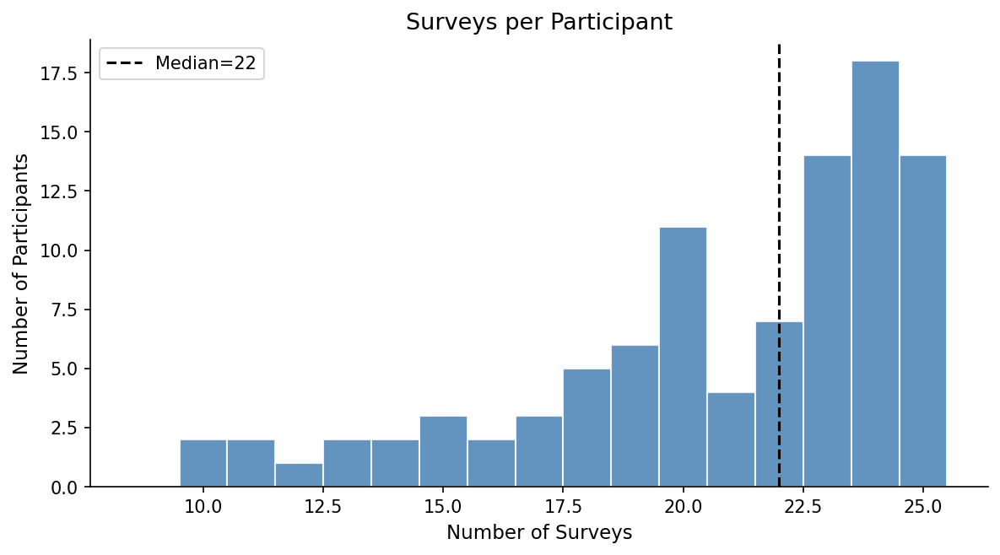

| Stat | Value |
|------|-------|
| Min | 10 |
| Max | 25 |
| Mean | 20.9 |
| Median | 22.0 |
| Std | 4.0 |
| 25th percentile | 19 |
| 75th percentile | 24 |

Most participants completed 19-25 survey periods. The maximum of 25 represents full study completion.

---

## 3. Demographics

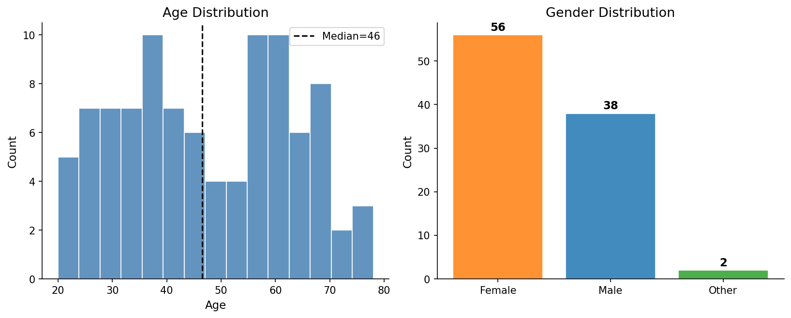

### Gender

| Gender | N | % |
|--------|---|---|
| Female (2) | 56 | 58.3% |
| Male (1) | 38 | 39.6% |
| Other (3) | 2 | 2.1% |

### Age

| Stat | Value |
|------|-------|
| Mean | 47.4 |
| Std | 15.7 |
| Min | 20 |
| Median | 46.5 |
| Max | 78 |
| 25th percentile | 35 |
| 75th percentile | 60 |

**Note:** Only `age` and `gender_mode` are available as demographic variables in this dataset. Ethnicity, education, income, and marital status are not included.

---

## 4. CES-D Score Distributions

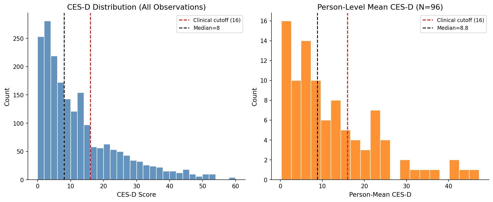

### All Observations (N = 2,002)

| Stat | Value |
|------|-------|
| Mean | 12.1 |
| Std | 11.9 |
| Median | 8.0 |
| Min | 0 |
| Max | 60 |

### By Severity Category

| Range | N | % |
|-------|---|---|
| 0-9 (minimal) | 1,068 | 53.3% |
| 10-15 (mild) | 372 | 18.6% |
| 16-19 (moderate) | 114 | 5.7% |
| 20-29 (mod-severe) | 243 | 12.1% |
| 30+ (severe) | 205 | 10.2% |

### Person-Level Summary

| Metric | Value |
|--------|-------|
| Mean of person-means | 12.4 |
| Median of person-means | 8.8 |
| Persons ever scoring >= 16 | 61 / 96 (63.5%) |
| Persons with mean >= 16 | 29 / 96 (30.2%) |

The distribution is right-skewed: the majority of observations fall below the clinical cutoff (16), but a substantial minority of participants have persistently elevated depression scores.

### Severity Distribution Over Time

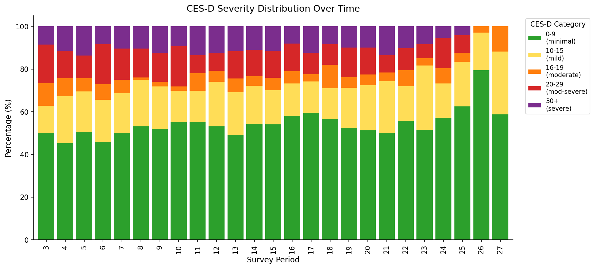

The proportion of participants in each severity band remains roughly stable across survey periods, with a slight trend toward more "minimal" scores in later periods (potentially reflecting attrition of more depressed participants or natural improvement over time).

---

## 5. Within-Person CES-D Trajectories

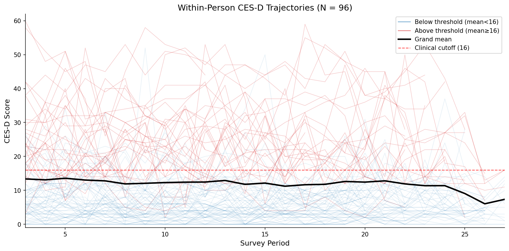

Individual CES-D trajectories are shown in blue (person-mean below clinical cutoff) and red (person-mean at or above cutoff). The grand mean (black line) is stable around 12 throughout the study, slightly below the clinical cutoff of 16 (dashed red line).

### Exemplar Trajectories

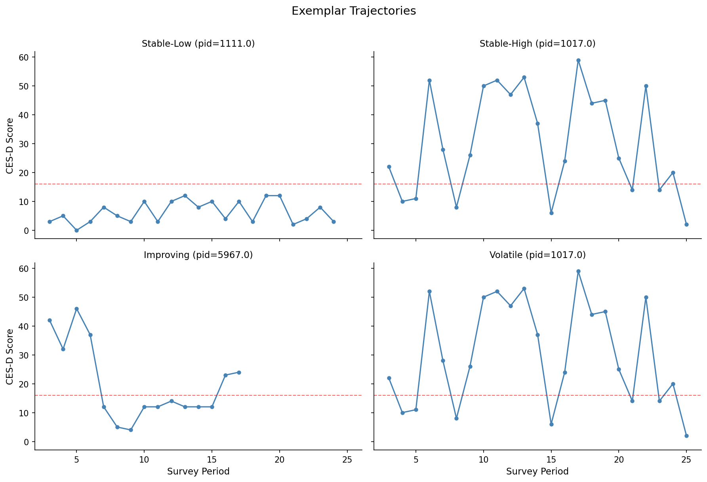

Four trajectory types illustrate the heterogeneity in the data:
- **Stable-Low**: Consistently low depression, minimal fluctuation
- **Stable-High**: Persistently elevated depression with high variability
- **Improving**: Starts high, trends downward over time
- **Volatile**: Large swings across the clinical threshold

### Trajectory Pattern Counts

| Pattern | N | % |
|---------|---|---|
| Stable (\|slope\| <= 0.2) | 51 | 53.1% |
| Improving (slope < -0.2) | 30 | 31.3% |
| Worsening (slope > 0.2) | 15 | 15.6% |

---

## 6. Within-Person Variability

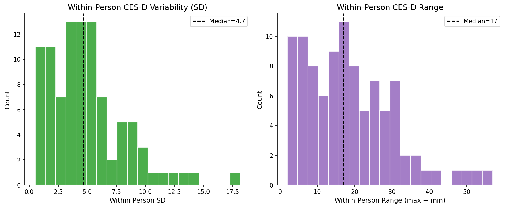

### Within-Person SD

| Stat | Value |
|------|-------|
| Mean | 5.0 |
| Median | 4.7 |
| Min | 0.5 |
| Max | 18.2 |

### Within-Person Range (max - min)

| Stat | Value |
|------|-------|
| Mean | 18.6 |
| Median | 17.0 |
| Min | 2 |
| Max | 57 |

### Clinical Threshold Crossings (>= 16)

| Metric | Value |
|--------|-------|
| People who cross threshold at least once | 55 / 96 (57.3%) |
| Mean crossings per person | 2.9 |

### Large Changes (>= 5 points between consecutive surveys)

| Metric | Value |
|--------|-------|
| People with at least one | 81 / 96 (84.4%) |
| Mean per person | 6.6 |

---

## 7. CES-D Change Scores & ICC Analysis

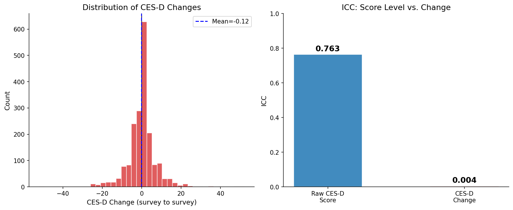

### Survey-to-Survey Change Distribution

| Stat | Value |
|------|-------|
| Mean | -0.12 |
| Std | 7.3 |
| Median | 0 |
| Min | -52 |
| Max | +52 |

### Intraclass Correlation Coefficient (ICC)

| Metric | Between-Person Var | Within-Person Var | ICC |
|--------|-------------------|-------------------|-----|
| **Raw CES-D score** | 116.6 | 36.1 | **0.763** |
| **CES-D change (delta)** | 0.23 | 55.0 | **0.004** |

This is a critical finding for the modeling approach:

- **Raw CES-D score ICC = 0.76**: 76% of variance in depression levels is between-person. People have stable trait-like differences in depression severity.
- **CES-D change ICC = 0.004**: Virtually 0% of variance in depression *change* is between-person. There is no stable "big changer" vs. "small changer" trait.

### Implications for Modeling

1. **Predicting change is fundamentally harder** than predicting level, because the signal is almost entirely occasion-specific rather than person-level.
2. **Time-varying features (screenome data) are essential** for predicting change - static person-level characteristics cannot explain within-person fluctuations.
3. **Autoregressive terms (`prior_cesd`) carry strong predictive value** for level but limited value for change, since change is nearly independent of person identity.
4. **Models should be evaluated on their ability to capture within-person dynamics**, not just overall accuracy (which can be inflated by correctly ranking person-level means).

---

## 8. Behavioral Features (Screenome-Derived)

The screenome captures a continuous stream of screenshots from participants' phones. From these raw screenshots, behavioral features are extracted per survey period. The feature engineering proceeds in multiple layers, each adding a different temporal perspective.

### 8.1 Base Features (10 features)

These are the core behavioral measures extracted from raw screenome data for each survey period:

| Feature | Description | Scale |
|---------|-------------|-------|
| `active_day_ratio` | Proportion of days with active screenome data | [0, 1] ratio |
| `mean_daily_screens` | Average screen captures per day (overall phone usage volume) | Count |
| `mean_daily_unique_apps` | Average unique apps used per day (app diversity) | Count |
| `mean_daily_switches` | Average app switches per day (behavioral fragmentation) | Count |
| `switches_per_screen` | App switches per screen capture (restlessness/rapid switching) | Rate |
| `mean_daily_overnight_ratio` | Proportion of screen time during overnight hours (circadian disruption) | [0, 1] ratio |
| `mean_daily_overnight_screens` | Overnight screen captures per day (derived: screens × overnight_ratio) | Count |
| `mean_daily_social_ratio` | Proportion of screen time on social media apps | [0, 1] ratio |
| `mean_daily_social_screens` | Social media screen captures per day (derived: screens × social_ratio) | Count |
| `clip_dispersion` | Content diversity across screenshots (from CLIP vision embeddings) | Continuous |

**Note on derived features:** `mean_daily_overnight_screens` and `mean_daily_social_screens` are computed as `mean_daily_screens × ratio`, converting proportions into absolute screen counts. This provides both the *pattern* (ratio: what fraction of usage) and the *dose* (count: how much total exposure).

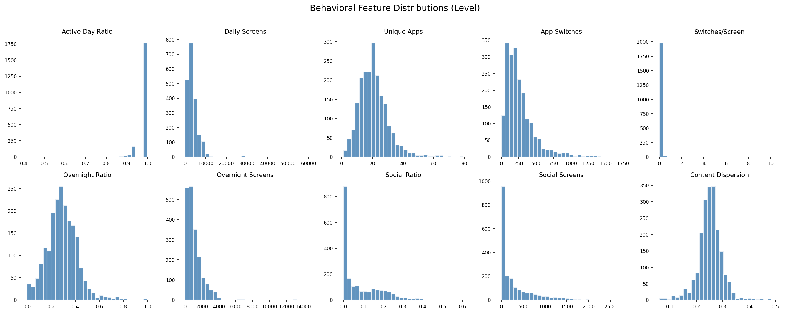

Key distributional notes:
- **Active day ratio** is heavily ceiling-skewed (most participants have ~100% active days)
- **Screen counts** (daily screens, overnight screens, social screens) are right-skewed with long tails
- **Social ratio** is zero-inflated — many participants have zero social media usage
- **Content dispersion** is approximately normal, centered around 0.25

### 8.2 Conceptual Feature Categories

The 10 base features map to 5 conceptual domains:

| Category | Features | What It Captures |
|----------|----------|-----------------|
| **Data Quality** | `active_day_ratio` | phone usage intensity / data availability |
| **Dosage** | `mean_daily_screens` | Overall phone usage intensity |
| **Fragmentation** | `mean_daily_unique_apps`, `mean_daily_switches`, `switches_per_screen` | App diversity, fragmentation, restlessness |
| **Circadian Pattern** | `mean_daily_overnight_ratio`, `mean_daily_overnight_screens` | Sleep disruption, late-night phone use |
| **Social Media Engagement** | `mean_daily_social_ratio`, `mean_daily_social_screens` | Social media exposure (pattern + dose) |
| **Content Diversity** | `clip_dispersion` | Visual content variety (from CLIP embeddings) |

### 8.3 Temporal Feature Transforms

Each base feature is transformed to capture different aspects of within-person temporal dynamics. The feature engineering creates multiple "views" of the same underlying behavior:

#### Delta Features (`_delta` suffix)
**What:** Change from the previous survey period: `feature(t) - feature(t-1)`

**Why:** Captures *behavioral shifts* — did the person start using their phone more overnight? Did their app switching increase? These within-person changes are directly relevant for predicting within-person mood changes (CES-D delta).

**Example:** `mean_daily_switches_delta` = 350 (period t) - 200 (period t-1) = +150, meaning the person's app switching increased by 150/day.

#### Deviation Features (`dev_` prefix)
**What:** Deviation from the person's own running mean: `feature(t) - running_mean(feature, person)`

**Why:** Captures whether behavior is *unusual for this person*. A person who normally has 500 daily screens but suddenly has 1000 is behaving unusually, even if 1000 is average for the sample. This within-person centering is critical because the ICC analysis shows that between-person differences dominate raw levels.

**Example:** If a person's running mean of daily screens is 3000, and this period they have 5000, their deviation is +2000 — flagging an unusual increase.

#### Lag Features (`lag_` prefix)
**What:** The value of features (and target delta) from the *previous* period, shifted by one time step.

**Why:** Captures temporal momentum and autoregressive patterns. If someone's behavior was already shifting last period, that trajectory may continue. The lag of `target_cesd_delta` (previous mood change) is especially informative — a worsening trend may predict continued worsening.

**Example:** `lag_mean_daily_switches_delta` = the change in switching that occurred in the *previous* transition. If switching was already increasing, it may continue.

### 8.4 Correlations with CES-D

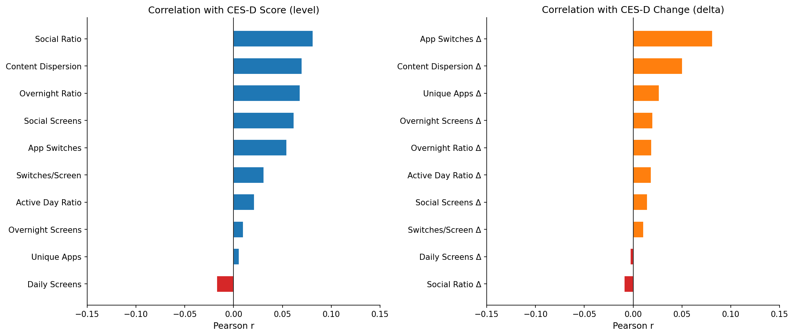

All individual correlations are small (|r| < 0.10), consistent with:
- Ecological behavioral data being noisy and multi-determined
- The near-zero ICC for CES-D change meaning there is no stable person-level behavioral signature to leverage
- The need for multivariate models and temporal feature combinations rather than individual features

The strongest correlations are:
- **Level features → CES-D score:** Social ratio (r=0.08), content dispersion (r=0.07), overnight ratio (r=0.07)
- **Delta features → CES-D change:** App switches delta (r=0.08), content dispersion delta (r=0.05)

### 8.5 Non-Screenome Features

In addition to screenome-derived behavioral features, the models include:

| Feature | Type | Description |
|---------|------|-------------|
| `prior_cesd` | Autoregressive | CES-D score at the previous survey (period t-1). This is the single strongest predictor of current CES-D level, reflecting the high ICC (0.76). |
| `person_mean_cesd` | Trait baseline | Running mean of a person's prior CES-D scores computed from training data only. Captures the person's stable depression "set point." Used in the best-performing model. |
| `age` | Demographic | Participant age (standardized). |
| `gender_mode` | Demographic | One-hot encoded as `gender_mode_1` (male) and `gender_mode_2` (female). `gender_mode_3` (Other, N=2) is dropped. |

### 8.6 Feature Sets (for Ablation & Comparison)

The codebase defines named, versioned feature sets to enable systematic comparison of what each feature group contributes:

| Feature Set | N Features | Contents | Temporal Transforms |
|-------------|-----------|----------|-------------------|
| `fs_core` v1.0 | 7 | active_day_ratio, mean_daily_screens, mean_daily_unique_apps, mean_daily_switches, mean_daily_overnight_ratio, mean_daily_social_ratio, switches_per_screen | running_mean, deviation, delta |
| `fs_core` v2.0 | 9 | v1.0 + std_daily_unique_apps, std_daily_switches | running_mean, deviation, delta |
| `fs_content` v1.0 | 5 | clip_n_screens, clip_dispersion, mean/std/median_embedding (CLIP) | running_mean, deviation |
| `fs_logs` v1.0 | 3 | days_in_period, active_days, period_qc_binary | none |

The ablation study tests 4 cumulative conditions to quantify each group's contribution:
1. **Prior CES-D only** — autoregressive baseline (no screenome)
2. **Behaviors only** — screenome features without knowing current depression level
3. **Behaviors + Prior CES-D** — combining screenome with autoregressive term
4. **Full (+ lag features)** — adding temporal momentum via lag-1 of all features

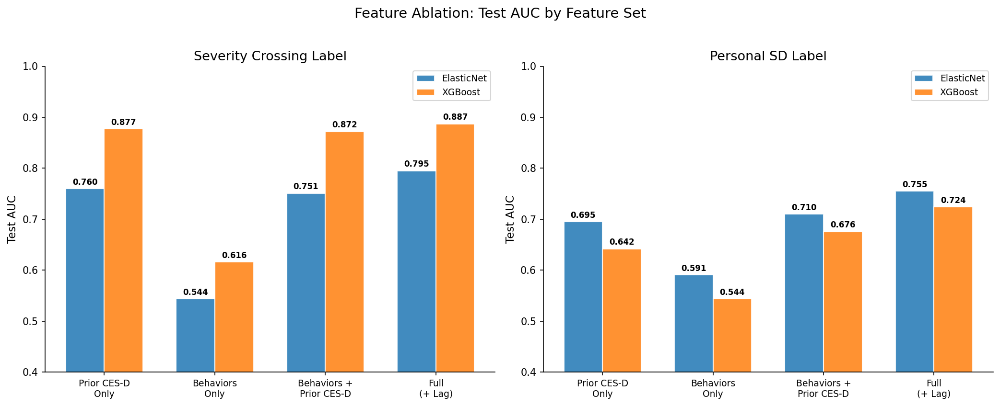

### 8.7 Final Feature List (Best Model)

The best-performing model (XGBoost with behavioral lag + person_mean_cesd; AUC=0.906 [0.881, 0.929], Sens-Worsening=0.838) uses the following feature matrix:

**Base features (21):**

| # | Feature | Type | Preprocessing |
|---|---------|------|---------------|
| 1 | `prior_cesd` | Autoregressive | Unscaled (clinical scale) |
| 2 | `active_day_ratio_delta` | Screenome delta | Unscaled (ratio) |
| 3 | `mean_daily_overnight_ratio` | Screenome level | Unscaled (ratio) |
| 4 | `mean_daily_overnight_ratio_delta` | Screenome delta | Unscaled (ratio) |
| 5 | `mean_daily_social_ratio` | Screenome level | Unscaled (ratio) |
| 6 | `mean_daily_social_ratio_delta` | Screenome delta | Unscaled (ratio) |
| 7 | `age` | Demographic | Standardized |
| 8 | `mean_daily_screens` | Screenome level | Standardized |
| 9 | `mean_daily_screens_delta` | Screenome delta | Standardized |
| 10 | `mean_daily_unique_apps` | Screenome level | Standardized |
| 11 | `mean_daily_unique_apps_delta` | Screenome delta | Standardized |
| 12 | `mean_daily_switches` | Screenome level | Standardized |
| 13 | `mean_daily_switches_delta` | Screenome delta | Standardized |
| 14 | `switches_per_screen` | Screenome level | Standardized |
| 15 | `switches_per_screen_delta` | Screenome delta | Standardized |
| 16 | `mean_daily_social_screens` | Screenome level | Standardized |
| 17 | `mean_daily_social_screens_delta` | Screenome delta | Standardized |
| 18 | `clip_dispersion` | Screenome level (content) | Standardized |
| 19 | `clip_dispersion_delta` | Screenome delta (content) | Standardized |
| 20 | `gender_mode_1` | Demographic | One-hot |
| 21 | `gender_mode_2` | Demographic | One-hot |

**Behavioral lag features (17, appended):**

The 17 time-varying behavioral base features shifted by one period (`lag_` prefix). Static demographics (age, gender_mode_1, gender_mode_2) are excluded from lag construction since they are constant across periods. Clinical lag features (lag_prior_cesd, lag_cesd_delta) are also excluded — ablation showed behavioral lag alone matches full lag performance. Missing lags (first observation) are filled with 0.

**Trait feature (1, appended):**

`person_mean_cesd` — the person's average prior_cesd from training data, capturing their stable depression baseline.

**Total: 39 features** (21 base + 17 behavioral lag + 1 trait)

Note: The original model used 44 features including redundant static lags (lag_age, lag_gender_mode_1, lag_gender_mode_2) and clinical lags (lag_prior_cesd, lag_cesd_delta). These were removed after analysis showed they contributed no predictive value (39 features vs 44 features produced equivalent AUC in ablation).

### 8.8 Preprocessing Pipeline

| Step | What | Details |
|------|------|---------|
| 1. VIF check | Multicollinearity filtering | Drop highest-VIF feature if VIF > 10 (fit on train) |
| 2. Unscaled | Ratios + prior_cesd kept as-is | Bounded [0,1] ratios and clinical-scale CES-D need no scaling |
| 3. Standardized | Count features, rates, deltas, age | z-scored (mean=0, std=1), scaler fit on train only |
| 4. One-hot encoding | Gender | Fit on train, `gender_mode_3` dropped (N=2) |
| 5. Lag construction | Shift time-varying behavioral features by 1 period within person | Built from scaled CSVs, fill NaN with 0. Excludes static demographics (age, gender) and clinical lag (lag_prior_cesd, lag_cesd_delta). |
| 6. Person trait | `person_mean_cesd` | Computed from training data only (no leakage) |

---

## 9. Data Pipeline

The raw data flows through the following pipeline:

```
data_clean.csv
    |
    v
build_data_infrastructure.py
    |
    +--> data/delta_table_final.parquet    (with delta features)
    +--> data/modeling_table.parquet        (filtered, with AR(1) lag)
    +--> data/processed/train_scaled.csv    (train split, scaled)
    +--> data/processed/val_scaled.csv      (validation split, scaled)
    +--> data/processed/test_scaled.csv     (test split, scaled)
```

### Modeling Table Filters
- Minimum period >= 2 (to allow AR(1) lag)
- QC filter applied (`period_qc_binary == 0`)
- Rows with missing `cesd_score` or `active_day_ratio` dropped

---

*Generated 2026-03-08, updated 2026-03-09. Figures in `reports/figures/`. Full experiment results and model analysis in `reports/experiment_spec.md`.*
